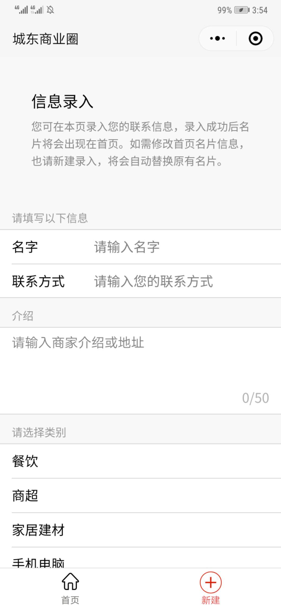
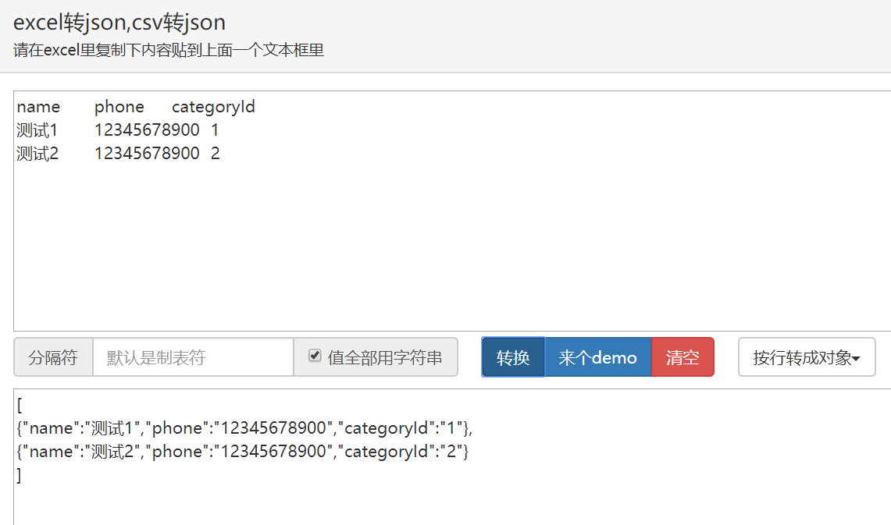

# 微信小程序 - 通讯录
## 功能
- 用户可查询、直接拨打商家（或相关用户）电话；
- 用户可在小程序中录入通讯信息，或由管理员后台批量导入。

#### 扫码体验

#### 屏幕截图

## 用到的工具
- 前端：[WeUI for 小程序 为微信小程序量身设计](https://github.com/Tencent/weui-wxss)

- 后端：[小程序云开发](https://developers.weixin.qq.com/miniprogram/dev/wxcloud/basis/getting-started.html)（开发者可以使用云开发开发微信小程序，无需搭建服务器，即可使用云端能力）

## note

- 由于代码中设定用户的 phone 字段为 string ,批量导入时建议以 json 格式导入，并指定值为字符串类型。可使用[在线转换工具](http://www.bejson.com/json/col2json/),如：

    

## 交流
如果你有好的意见或建议，欢迎提issue或pull request。
