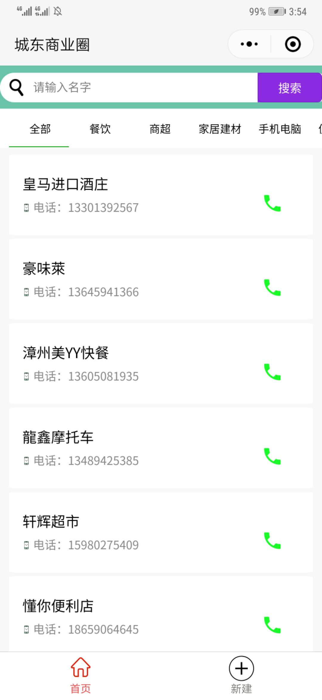
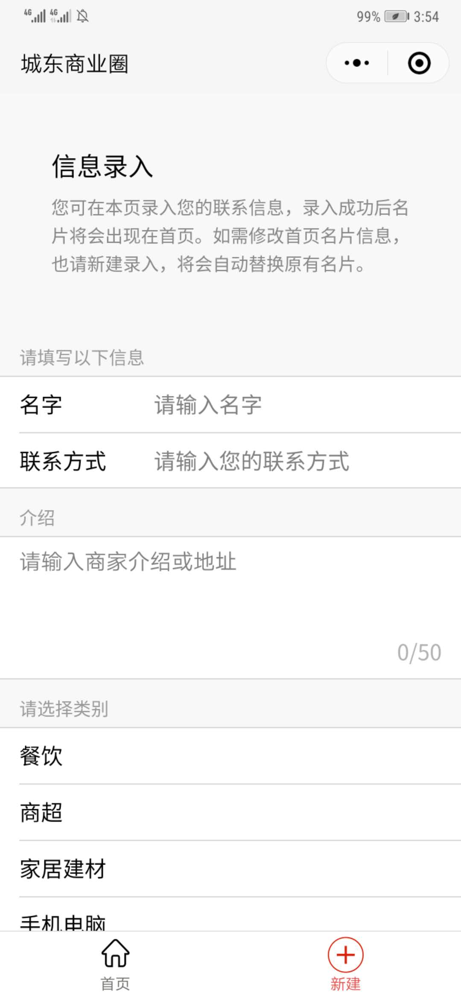

# 微信小程序 - 通讯录
## 功能
- 用户可查询、直接拨打商家电话；
- 商家可录入通讯信息。

#### 扫码体验

#### 屏幕截图

## 用到的工具
- 前端：[WeUI for 小程序 为微信小程序量身设计](https://github.com/Tencent/weui-wxss)

- 后端：[小程序云开发](https://developers.weixin.qq.com/miniprogram/dev/wxcloud/basis/getting-started.html)（开发者可以使用云开发开发微信小程序、小游戏，无需搭建服务器，即可使用云端能力）

## 交流
如果你有好的意见或建议，欢迎提issue或pull request。
